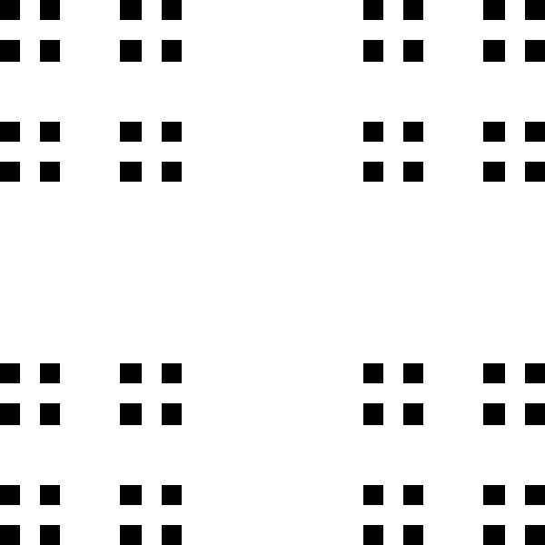
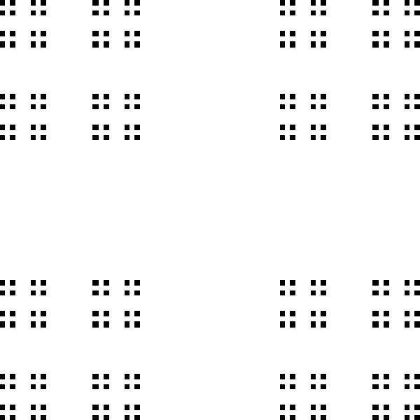

# Cantor Dust 2D

A visual representation of the 2D [Cantor Set](https://en.wikipedia.org/wiki/Cantor_set). This program generates PNG images showing different layers of the Cantor dust pattern.

## Description

This program uses RGB tuples to create PNG images, using (0,0,0) for black and (255,255,255) for white pixels. The algorithm recursively divides squares to create the Cantor dust pattern.

## Examples

<div style="display: flex; gap: 10px;">
  
  
  
</div>

## Requirements

- Python 3
- pypng library

## Installation

1. Clone this repository
2. Install the required dependencies:
```bash
pip install pypng
```

## Usage

Run the main script to generate Cantor dust images:

```bash
python main.py
```

After execution, PNG images are saved in the `images/` directory. The number of images depends on the layer count specified in the code (6 by default).

## How it works

The program contains these key functions:

- **create_image**: Creates a black background as a matrix
- **color_pixel**: Sets the color of a specific pixel on the background
- **color_full_rectangle**: Draws two rectangles (which create the white crosses in the middle) on the black image
- **division**: A recursive function that divides squares and draws white crosses, creating smaller squares based on layer depth
- **clean**: Handles precision issues from integer division by cleaning dirty rows.
- **rotate_left**: Rotates the image to clean pixels on columns (which become rows after rotation)
- **set_img**: Main processing loop that generates images for each layer and put them in a directory called images

## Notes

- **Default size**: 600x600 pixels (designed to be square)
- **Layer limit**: 6 layers
- **Larger images**: For bigger images (e.g., 900x900), you can have one more layer


